<p align="center">
  
</p>

<h1 align="center">Bookshelf</h1>

<p align="center">
  A quiet place to keep track of the books you read, and to write down what they meant to you.<br>
  A free, private reading journal for Linux, Windows and Mac.
</p>

<p align="center">
  <a href="https://github.com/E36lewis/bookshelf/releases/latest"><strong>Download</strong></a> ·
  <a href="https://e36lewis.github.io/bookshelf/">Website</a> ·
  <a href="MANUAL.md">User manual</a> ·
  <a href="#install">Install</a>
</p>

Bookshelf keeps three shelves (Reading, Finished and Eventually). Add books from [Open Library](https://openlibrary.org/), note when you started and finished each one, and write your own summary in a calm Markdown writer with focus mode, full screen and autosave. Your journal stays on your computer: there's no account, and nothing you write is ever sent anywhere.

> [!NOTE]
> **The first release, 0.9, is nearly here.** If [the releases page](https://github.com/E36lewis/bookshelf/releases/latest) is still empty, please check back in a few days. 0.9 means "nearly 1.0": everything is in place, and the Mac app is still being tested by real readers before 1.0.

## Screenshots

Bookshelf is a native app on each system: GTK 4 and libadwaita on Linux, WinUI 3 on Windows, SwiftUI on the Mac. All three share one Rust core. These screenshots use a made-up reader's journal; click any of them to see it full size.

| | Linux | Windows | Mac |
|---|---|---|---|
| **Shelf** | 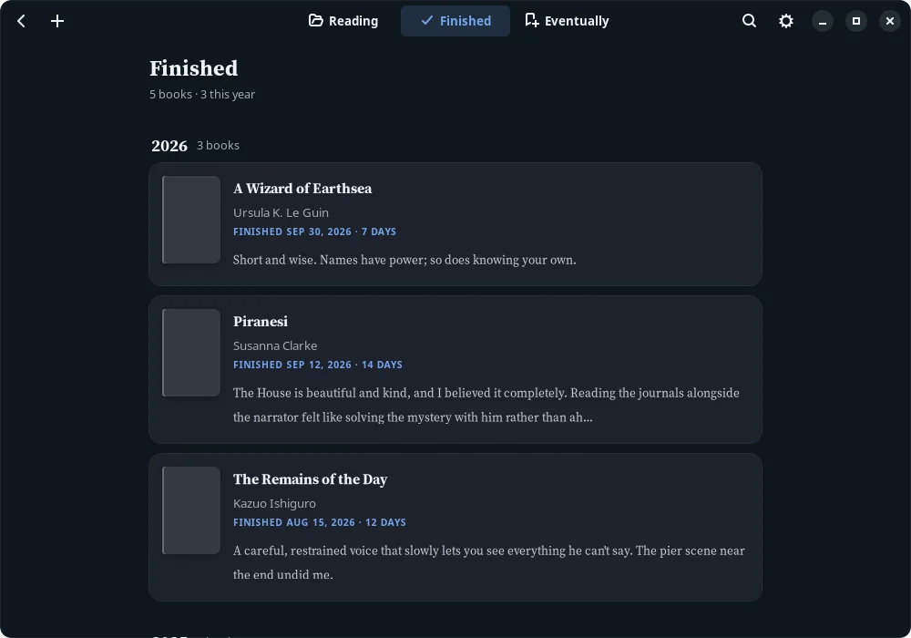 | 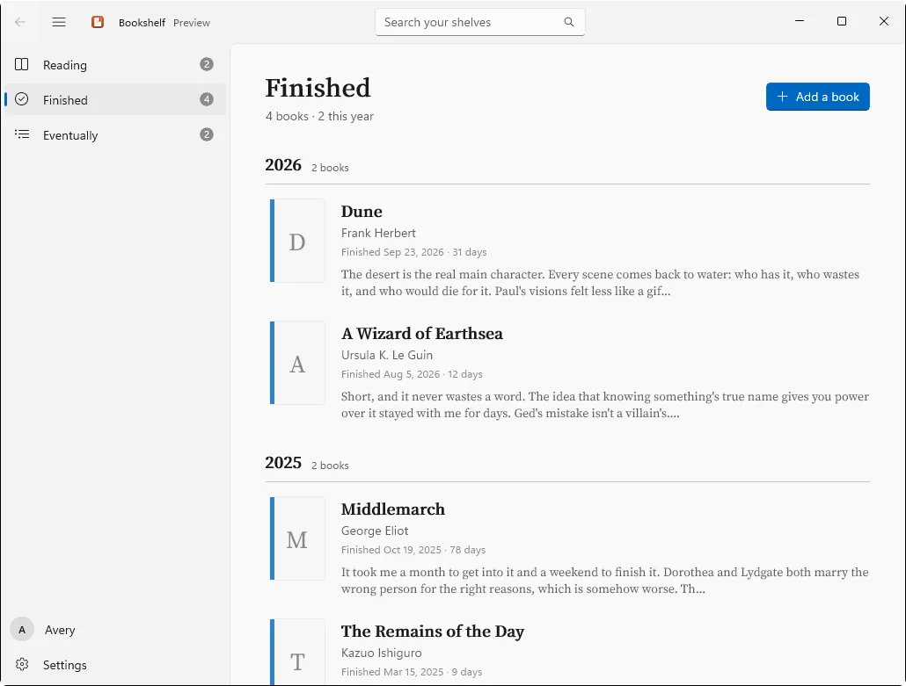 | 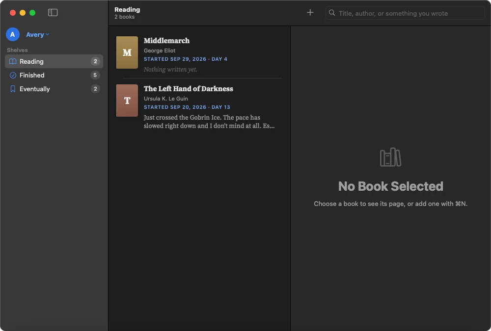 |
| **A book's page** | 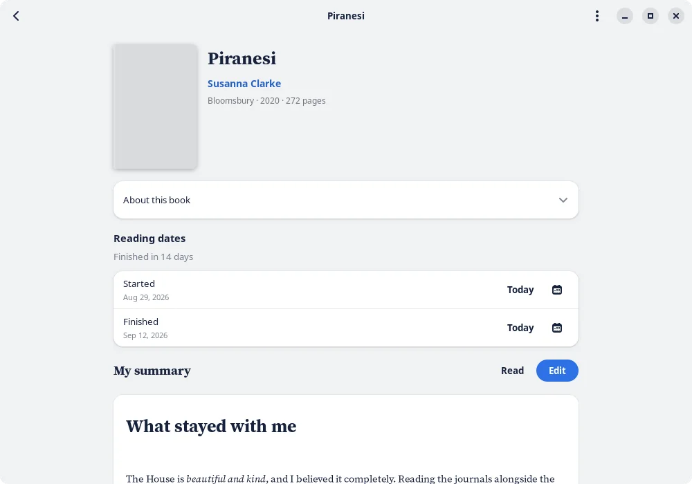 | 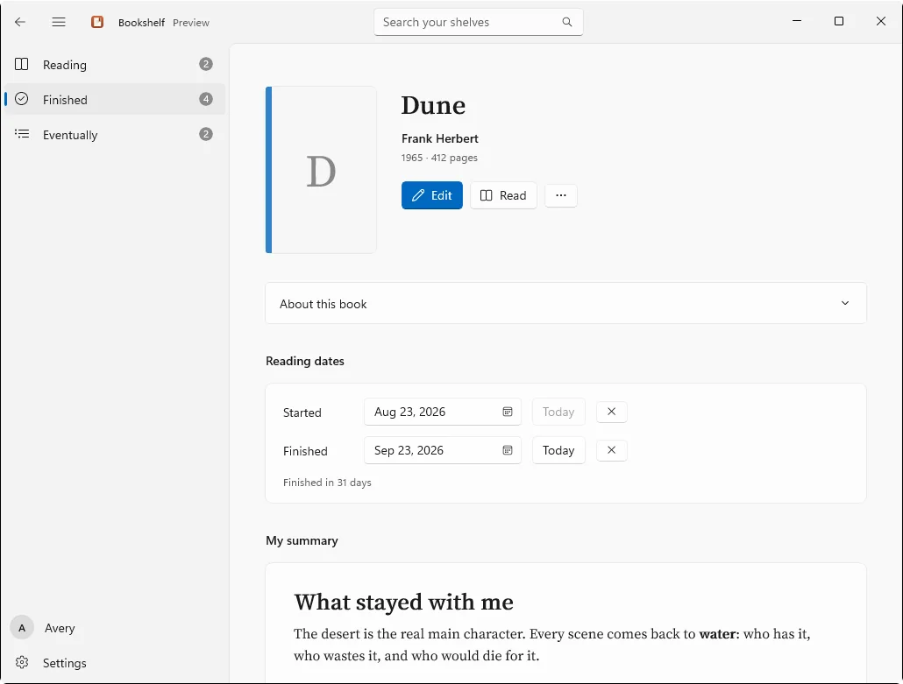 | 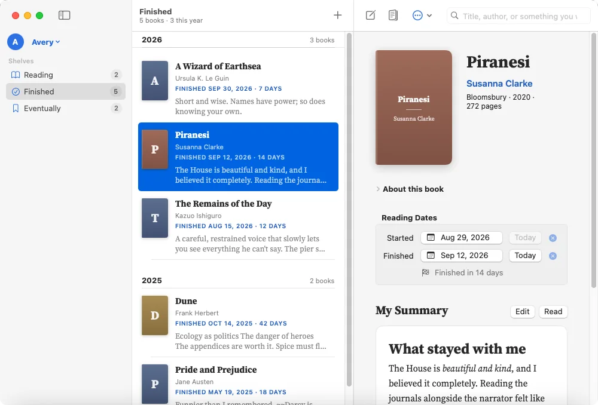 |
| **Writing** | 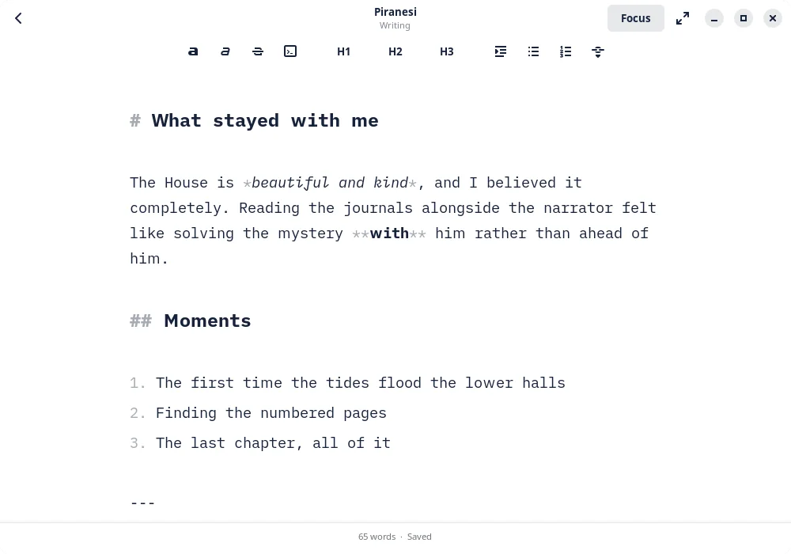 | 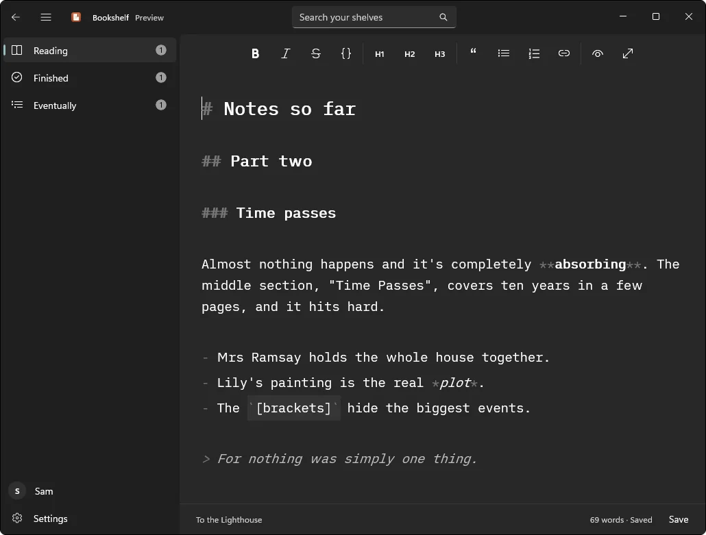 | 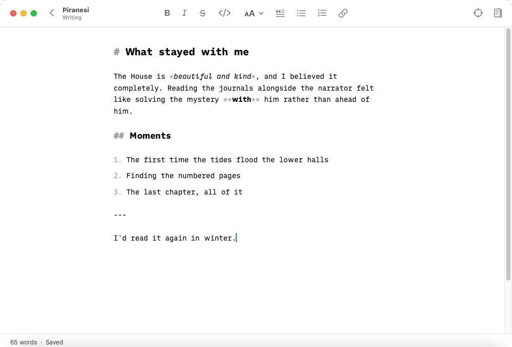 |
| **Reading** | 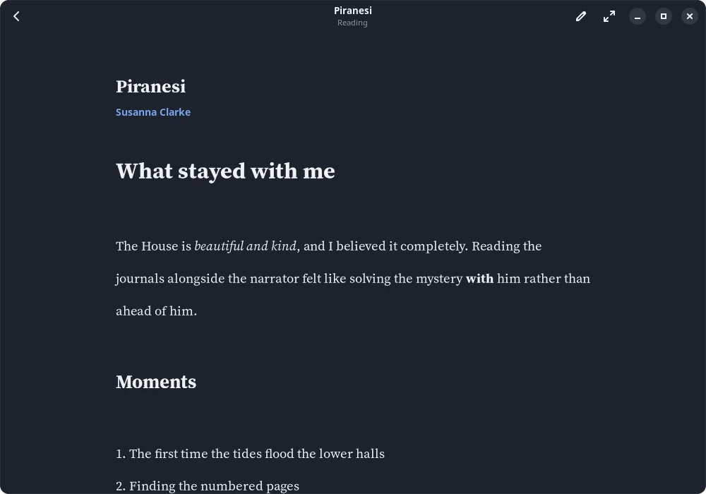 | 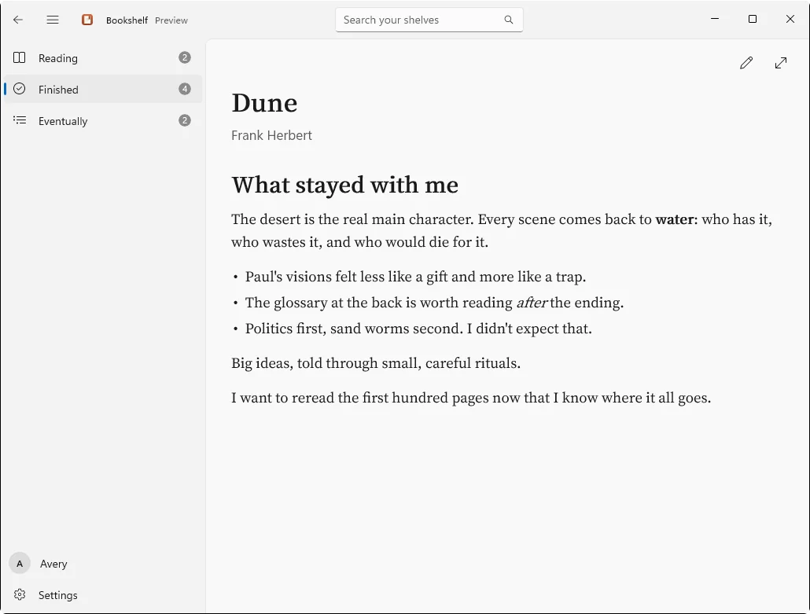 | 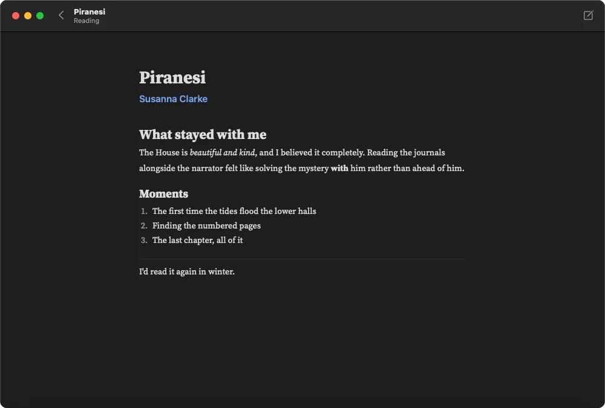 |

## Features

- **Three shelves**: Reading, Finished (grouped by year, with this year's count) and Eventually.
- **Add any book** from Open Library by title, author or ISBN. The cover and description come with it.
- **Reading dates**: when you started and finished, and how many days it took. A book's dates decide its shelf.
- **A calm writer**: one column of text, Markdown with the marks dimmed, and gentle prompts on an empty page.
- **Focus mode** (typewriter-style) and **full screen**.
- **Saves as you type.** If saving ever fails, your words are kept safe, never thrown away.
- **A reader** that shows your summary nicely set, with nothing around it.
- **Search** titles, authors and everything you've written, across all three shelves.
- **Read it again**: a fresh entry for a favourite, with its own dates and summary.
- **A profile for everyone** who reads in your home.
- **Make it yours**: light or dark, eight accent colors or any you like, and your choice of font, text size, line spacing and page width.
- **Daily backups** (the last seven, kept wherever you like) and **export** of every summary as a Markdown file.

The [user manual](MANUAL.md) explains everything. It's also built into the app: <kbd>F1</kbd> on Linux and Windows, <kbd>⌘?</kbd> on a Mac.

## Install

Download the file for your computer from the [latest release](https://github.com/E36lewis/bookshelf/releases/latest).

<!-- File names and requirements: this table is the one place in the README they're spelled out. -->
| For | File | Needs |
|---|---|---|
| Windows | `Bookshelf-0.9.0-setup-x64.exe` | Windows 10 (version 1809 or newer) or Windows 11, 64-bit (x64), with Windows Update up to date |
| Mac | `Bookshelf-0.9.0.dmg` | macOS 14 Sonoma or newer |
| Linux | `Bookshelf-0.9.0-x86_64.AppImage` | 64-bit, Ubuntu 24.04, Fedora 40, Debian 13 or newer |
| Checking | `SHA256SUMS` | Optional: see [Checking your download](#checking-your-download) |

The first time you open Bookshelf, your computer may ask you to confirm. That's because it's a free project, not a company with paid certificates. Here's what you'll see, and why.

### Windows

1. Download the setup file. If your browser says it *isn't commonly downloaded*, choose **Keep**.
2. Open it. If a blue box says *Windows protected your PC*, click **More info**, then **Run anyway**.
3. Follow the installer's steps. It installs Bookshelf just for you, so it doesn't need an administrator password.
4. Open Bookshelf from the Start menu.

**What to expect, and why**

- **The blue *Windows protected your PC* box.** Windows shows it for apps that aren't signed with a paid code-signing certificate. Those cost money every year, and Bookshelf is a free, open-source project, so it isn't signed yet. The box doesn't mean anything is wrong with the file. To be sure your copy is genuine, see [Checking your download](#checking-your-download).
- **Smart App Control.** If it's switched on (Windows 11 only), it blocks apps that aren't paid-signed, with no way past it. Bookshelf can't run there until it's signed.
- **A message asking you to update Windows.** Bookshelf uses a security feature that only up-to-date Windows has. If a required update is missing, the installer stops and says so, before changing anything. Run Windows Update and try again.
- **Removing it:** **Settings › Apps**, find Bookshelf, **Uninstall**. Your journal is kept.

### Mac

1. Open the `.dmg` and drag **Bookshelf** onto **Applications**.
2. Open Bookshelf from Applications. The first time, your Mac won't open it and says it can't check it. Click **Done**.
3. Open **System Settings › Privacy & Security**, scroll down to the message about Bookshelf, click **Open Anyway** and confirm. You only need to do this once.

**What to expect, and why**

- **The Mac blocks the first launch.** Apple checks ("notarizes") apps for developers who pay $99 a year. Bookshelf isn't notarized yet, so your Mac asks you to confirm once that you trust it.
- **On macOS 14 Sonoma** you can instead Control-click (or right-click) Bookshelf in Applications and choose **Open**.
- **Removing it:** drag Bookshelf to the Trash. Your journal stays on your Mac.

### Linux

1. Download the AppImage.
2. Make it executable: open its **Properties** in your file manager and turn on **Allow executing file as program** (the wording varies), or run `chmod +x Bookshelf-*.AppImage`.
3. Double-click it.

**What to expect, and why**

- **Nothing gets installed.** An AppImage is the whole app in one file. Downloaded files can't run until you allow it, which is why step 2 is needed.
- **On Ubuntu**, AppImages need FUSE 2. If Bookshelf doesn't start, run `sudo apt install libfuse2t64`.
- **Removing it:** delete the file. Your journal stays in `~/.local/share/bookshelf`.

### Checking your download

Optional, for anyone who'd like to be sure their copy is exactly what was published.

- **Fingerprint:** `SHA256SUMS` lists a SHA-256 checksum for every file. Compare yours with its line there:
  - Windows (PowerShell): `Get-FileHash .\Bookshelf-*-setup-x64.exe`
  - Mac: `shasum -a 256 Bookshelf-*.dmg`
  - Linux: `sha256sum -c SHA256SUMS --ignore-missing`
- **Where it came from:** every file is built by GitHub Actions from this repository's code, and GitHub signs a record of that (an attestation). With the [GitHub CLI](https://cli.github.com/), signed in:

  ```sh
  gh attestation verify <the file you downloaded> --repo E36lewis/bookshelf
  ```

## Privacy

- No account, no sign-in, no ads, no tracking. Your summaries never leave your computer.
- Bookshelf only connects to `openlibrary.org` and `covers.openlibrary.org`, to search for books and fetch their details and covers. [Open Library](https://openlibrary.org/) is a free, public library catalogue run by the Internet Archive.
- An email address in your profile is optional. If you add one, it's sent with those requests so Open Library can contact you about a problem. Leave it blank to send nothing.
- Profiles keep shelves apart but aren't password protected: anyone using your computer account can open any profile.
- The [website](https://e36lewis.github.io/bookshelf/) has no cookies, analytics or third-party resources either.

## Building from source

Everything shares the Rust workspace at the root (the toolchain version is pinned in `rust-toolchain.toml`):

| Path | What it is |
|---|---|
| `bookshelf-core/` | The shared core: the journal database, Open Library, Markdown, backups and export |
| `bookshelf-app/` | The Linux app (GTK 4 and libadwaita) |
| `bookshelf-ffi/` | The core exposed to Swift and C# through UniFFI (`scripts/gen-bindings.sh` regenerates the bindings) |
| `bookshelf-cli/` | A small terminal tool for trying out the core |
| `apple/` | The macOS app (SwiftUI) |
| `windows/` | The Windows app (WinUI 3, .NET) |

**Linux** (needs `libgtk-4-dev` and `libadwaita-1-dev`, or your distribution's equivalent):

```sh
cargo test --workspace               # the core and the GTK app's tests
cargo run -p bookshelf-app           # run the app
bash install-local.sh                # build and add it to your app menu
bash packaging/build-appimage.sh     # build the AppImage (see packaging/README.md)
```

Set `BOOKSHELF_DIR` to an empty folder to try things out without touching your own journal. Debug builds can also retake the Linux screenshots on a made-up journal: see `bookshelf-app/src/shots.rs`.

**macOS** (needs Xcode and [XcodeGen](https://github.com/yonaskolb/XcodeGen)):

```sh
apple/scripts/build-xcframework.sh   # the Rust core, for Apple silicon and Intel
cd apple && xcodegen generate        # then open Bookshelf.xcodeproj in Xcode
```

**Windows** (needs the .NET 10 SDK):

```sh
cargo build --release -p bookshelf-ffi
dotnet publish windows/Bookshelf/Bookshelf.csproj -c Release -r win-x64 -p:Platform=x64 -o windows/build/Bookshelf
```

The workflows in `.github/workflows/` show the exact steps CI uses on each system.

## Licence

Bookshelf is free software under the [GNU General Public License, version 3 or later](LICENSE), with an additional permission for linking with Microsoft's Windows App SDK. See [NOTICE.md](NOTICE.md). The bundled fonts, iA Writer Duo and Source Serif 4, are under the SIL Open Font License; their licences are in `packaging/fonts/`.
